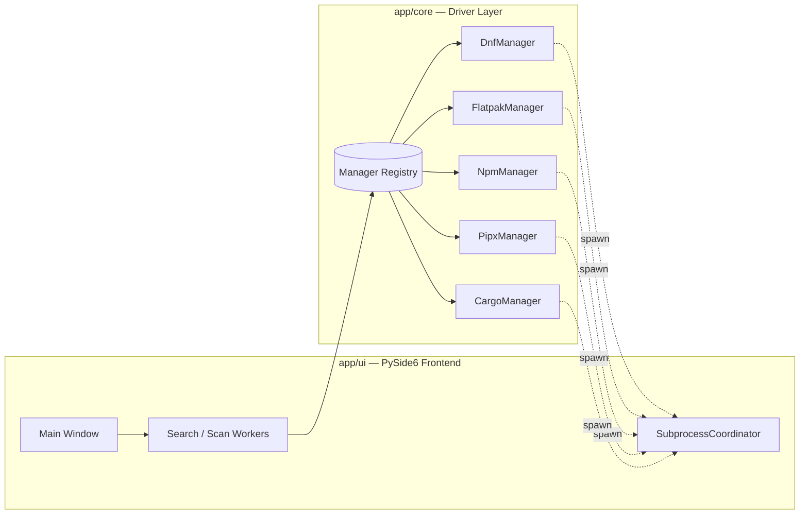

<div align="center">

```
██████╗  ██████╗ ██╗  ██╗   ██╗ ██████╗ ███████╗████████╗
██╔══██╗██╔═══██╗██║  ╚██╗ ██╔╝██╔════╝ ██╔════╝╚══██╔══╝
██████╔╝██║   ██║██║   ╚████╔╝ ██║  ███╗█████╗     ██║
██╔═══╝ ██║   ██║██║    ╚██╔╝  ██║   ██║██╔══╝     ██║
██║     ╚██████╔╝███████╗██║   ╚██████╔╝███████╗   ██║
╚═╝      ╚═════╝ ╚══════╝╚═╝    ╚═════╝ ╚══════╝   ╚═╝
```

### 𓂀 One graphical store. Every package manager you have. 𓂀

*DNF · Flatpak · NPM · Pipx · Cargo — unified under a single obsidian pane of glass.*

[](https://www.python.org/)
[](https://doc.qt.io/qtforpython/)
[](#license)
[](#supported-platforms)
[](#roadmap)

</div>

---

## ⛧ What Is This

Every Linux distro splits package management across two, three, sometimes five different tools — and none of them talk to each other. **PolyGet** is a single PySide6 desktop application that discovers whatever package managers you actually have installed, shows you what's outdated across *all of them* in one list, and lets you browse, search, and install new software like a proper app store — instead of five different terminal incantations you have to remember.

Built solo, for a real dual-machine dev workflow (Arch-based desktop + Fedora-based Apple Silicon laptop), so distro-awareness isn't an afterthought — it's load-bearing.

<div align="center">

| ⚙️ System | 📦 Universal | 🐍 Language / Dev |
|:---:|:---:|:---:|
| **DNF** · **Pacman** | **Flatpak** | **Pipx** · **RubyGems** |
| Fedora & Arch / CachyOS | Sandboxed, cross-distro | Isolated Python & Ruby tools |
| | | **NPM** · **Cargo** |
| | | Node & Rust global installs |

</div>

---

## 𓋴 Origin Story

Every friendly Linux distro has an origin story like this: **Linux Mint** exists because Clément Lefèbvre wanted something more approachable than what was out there for people just getting started. **PolyGet** exists for the same reason, just scoped smaller — a friend wanted to learn Linux, and the terminal-only, five-different-commands-for-five-different-managers reality of a modern system was a rough on-ramp.

So this got built: one graphical place to see what's outdated, search for new software, and install it — without needing to already know whether something lives in DNF, Flatpak, or somewhere else entirely. The kind of tool you hand someone on day one, not the kind you make them earn.

---

## 𓆃 Table of Contents

- [Features](#-features)
- [Screenshots](#-screenshots)
- [Architecture](#-architecture)
- [Installation](#-installation)
- [Usage](#-usage)
- [Roadmap](#-roadmap)
- [Project Structure](#-project-structure)
- [Contributing](#-contributing)
- [License](#-license)

---

## ✦ Features

<table>
<tr>
<td width="50%">

### 🔄 Unified Update Scanning
Every registered manager is checked in parallel via `asyncio`. One list, every outdated package, regardless of which tool owns it.

### 🖥️ Native Desktop UI
Built on PySide6/Qt — no Electron, no browser runtime. A dark, obsidian-toned interface that feels like it belongs on your desktop.

### 🛡️ Safe Privilege Escalation
System-level operations elevate via `pkexec`/PolicyKit — no plaintext passwords on the command line, no unnecessary standing root access.

</td>
<td width="50%">

### 🧭 Process Lifecycle Coordination
A singleton subprocess coordinator tracks every spawned process group, so cancelling an upgrade never leaves orphaned children running in the background.

### 📜 Declarative Blueprints
Export your entire installed-package state — across every backend — to a clean YAML blueprint. Reproduce your setup on another machine, or just keep a record.

### 🧩 Distro-Aware by Design
Built across an Arch-based desktop and a Fedora-based Apple Silicon laptop — the architecture assumes more than one package-manager family from day one.

</td>
</tr>
</table>

---

## 🖼️ Screenshots

<div align="center">

*(Add your own screenshots here — drop image files into an `assets/` folder and reference them below.)*

| Update Dashboard | Manager Store |
|:---:|:---:|
|  |  |

</div>

---

## 𓋹 Architecture



Each package manager is a self-contained driver implementing a shared `PackageManager` interface (`is_available`, `check_updates`, `list_installed`, `get_upgrade_command`). Drivers self-register via a decorator, so the registry — and the UI — never need to know about a specific manager by name.

---

## ⚔️ Installation

**Requirements:** Python 3.11+, a PySide6-compatible desktop (KDE Plasma, GNOME, etc.)

<details open>
<summary><b>Fedora / RHEL / Asahi Linux (Fedora Remix)</b></summary>

```bash
sudo dnf install python3-pip python3-virtualenv
git clone https://github.com/DaRipper91/PolyGet.git
cd PolyGet
python3 -m venv .venv
source .venv/bin/activate
pip install -r requirements.txt
python run.py
```
</details>

<details>
<summary><b>Arch / CachyOS / Manjaro</b></summary>

```bash
sudo pacman -S python-pip python-virtualenv
git clone https://github.com/DaRipper91/PolyGet.git
cd PolyGet
python3 -m venv .venv
source .venv/bin/activate
pip install -r requirements.txt
python run.py
```
</details>

<details>
<summary><b>Debian / Ubuntu</b></summary>

```bash
sudo apt install python3-pip python3-venv
git clone https://github.com/DaRipper91/PolyGet.git
cd PolyGet
python3 -m venv .venv
source .venv/bin/activate
pip install -r requirements.txt
python run.py
```
</details>

---

## 𓊹 Usage

```bash
source .venv/bin/activate
python run.py
```

On launch, PolyGet scans your system for every supported package manager, shows what's outdated across all of them, and lets you upgrade individually or in bulk. Head to the **Store** tab to search and install new software from any available backend.

---

## 🗺️ Roadmap

- [x] Unified update dashboard across **7 backends** (DNF, Pacman, Flatpak, NPM, Pipx, Cargo, RubyGems)
- [x] Declarative YAML blueprint export/import
- [x] Process-group-safe subprocess coordination (no orphan backends)
- [x] Manager Store — browse & install package managers you don't have yet
- [x] Distro-aware self-install commands (Fedora / Arch / Debian family detection)
- [x] Repos tab — manage DNF repos/COPR and Flatpak remotes
- [x] Driver-based package search refactored out of the main UI thread
- [x] Auto-discovery of driver plugins (dynamic module scanner)
- [x] Companion Textual-based TUI upgrader interface
- [x] Automated background update scanning daemon with system notifications
- [ ] Support for source-based Gentoo Portage driver (emerge)

---

## 𓆎 Project Structure

```
PolyGet/
├── run.py                  # Entry point launcher
├── requirements.txt
├── app/
│   ├── core/
│   │   ├── manager.py       # Base PackageManager interface + registry
│   │   ├── blueprint.py     # YAML import/export
│   │   ├── coordinator.py   # Subprocess lifecycle tracking
│   │   └── drivers/         # dnf.py · flatpak.py · npm.py · pipx.py · cargo.py
│   └── ui/
│       ├── main_window.py   # PySide6 main window & workers
│       └── tui.py           # Companion Textual TUI
└── tests/
```

---

## 𓋴 Contributing

This is currently a solo project built for a personal dev workflow, but issues and pull requests are welcome — especially new package manager drivers (pacman, apt, zypper, and beyond all fit the existing `PackageManager` interface cleanly).

---

## ⚰️ License

MIT — see [`LICENSE`](LICENSE) for details.

<div align="center">

*𓂸 built in the dark, shipped in the open 𓂸*

</div>
